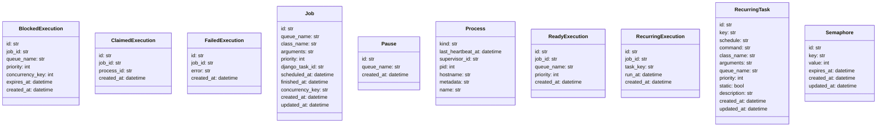

# Robust Queue

## Model

```mermaid
classDiagram

class BlockedExecution {
    id: str
    job_id: str
    queue_name: str
    priority: int
    concurrency_key: int
    expires_at: datetime
    created_at: datetime
}

class ClaimedExecution {
    id: str
    job_id: str
    process_id: str
    created_at: datetime
}

class FailedExecution {
    id: str
    job_id: str
    error: str
    created_at: datetime
}

class Job {
    id: str
    queue_name: str
    class_name: str
    arguments: str
    priority: int
    django_task_id: str
    scheduled_at: datetime
    finished_at: datetime
    concurrency_key: str
    created_at: datetime
    updated_at: datetime
}

class Pause {
    id: str
    queue_name: str
    created_at: datetime
}

class Process {
    kind: str
    last_heartbeat_at: datetime
    supervisor_id: str
    pid: int
    hostname: str
    metadata: str
    name: str
}

class ReadyExecution {
    id: str
    job_id: str
    queue_name: str
    priority: int
    created_at: datetime
}

class RecurringExecution {
    id: str
    job_id: str
    task_key: str
    run_at: datetime
    created_at: datetime
}

class RecurringTask {
    id: str
    key: str
    schedule: str
    command: str
    class_name: str
    arguments: str
    queue_name: str
    priority: int
    static: bool
    description: str
    created_at: datetime
    updated_at: datetime
}

class Semaphore {
    id: str
    key: str
    value: int
    expires_at: datetime
    created_at: datetime
    updated_at: datetime
}
```
